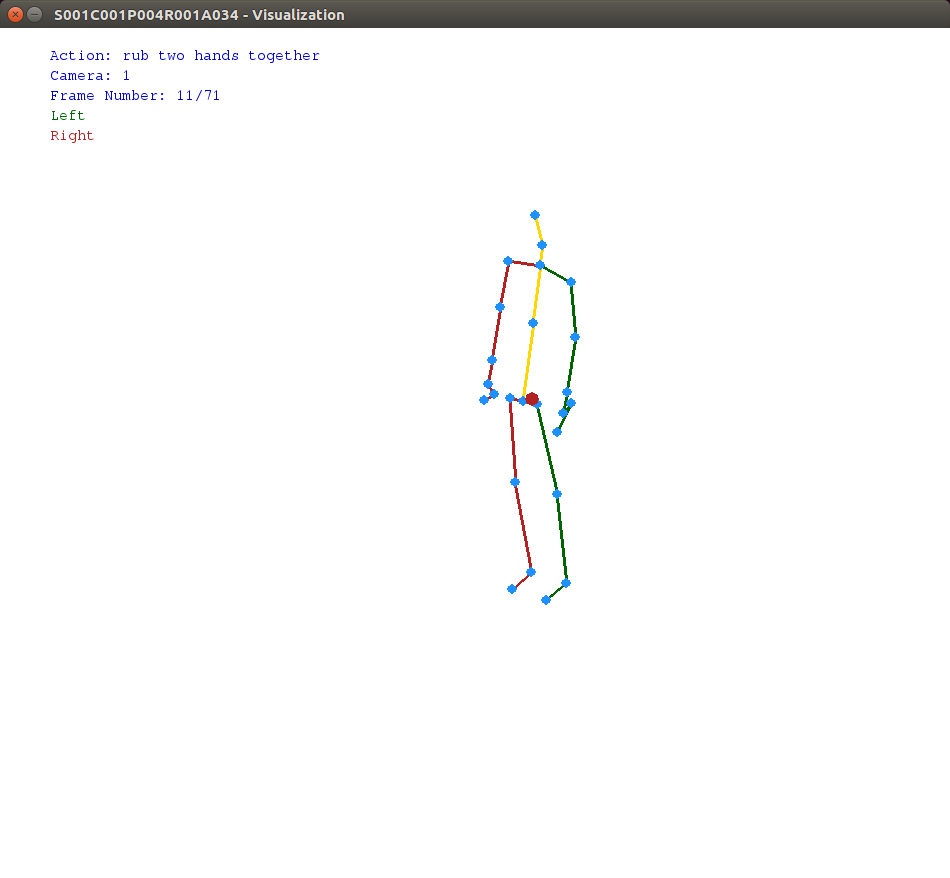

# Skeleton Visualizer Tool

Tool made in Python, using pygame, which allows skeletons to be displayed and rotated. This is useful for displaying [NTU RGB+D Action Recognition Dataset](https://github.com/shahroudy/NTURGB-D).

## Requirements

To use this application, you need the following software:

* **Python3** (Version: 3.5.2);
* **NumPy** (Version: 1.13.1);
* **Pygame** (Version: 1.9.3).

## Graphical User Interface

The graphical interface contains the following components:

* The title of the frame that contains the name of the file in the dataset (is in the format of SsssCcccPpppRrrrAaaa, for which sss is the setup number, ccc is the camera ID, ppp is the performer ID, rrr is the replication number and aaa is the action class label);
* The top of the frame displays informaton about the file (action class label, the camera ID, frame number and colors for the left and right sides of the skeleton);
* Skeleton or skeletons (blue circles for joints, yellow lines for the central axis, green lines for the left side and red lines for the right side).

Below is an example of frame:




## Commands
The following keys were used for commands:

* **r** - resetting the angles of rotation and restores the scene as it was originally;
* **q** - increments the rotaton angle for Ox;
* **w** - decrements the rotaton angle for Ox;
* **a** - increments the rotaton angle for Oy;
* **s** - decrements the rotaton angle for Oy;
* **z** - increments the rotaton angle for Oz;
* **x** - decrements the rotaton angle for Oz;
* **SPACE** - move to the next frame;
* **BACKSPACE** - move to the previous frame;
* **ESC** - close the application.

## Usage

```
python3 read_skeleton_file.py [-h] [-s SAMPLE_FILENAME] [-a ACTIONS_FILENAME] 
```
Example
```
python3 read_skeleton_file.py -s dataset/S001C001P004R001A034.skeleton -a actions.txt
```

## File format

```
<no_of_the_recorded_frames>
<no_of_observed_skeletons_in_current_frame>
<bodyID> <clippedEdges> <handLeftConfidence> <handLeftState> <handRightConfidence> <handRightState> <isRestricted> (7 integers)
<no_of_joints> (n)
................................ (line 1)
<x> <y> <z> <depthX> <depthY> <colorX> <colorY> <orientationW> <orientationX> <orientationY> <orientationZ> <tracking_state> (11 floats + 1 integer|line i)
................................ (line n)
```

